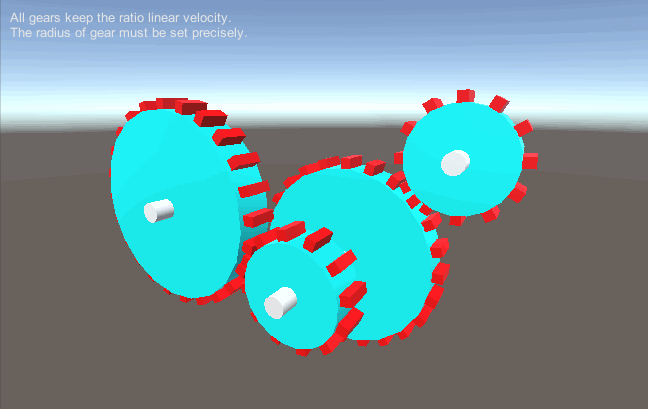
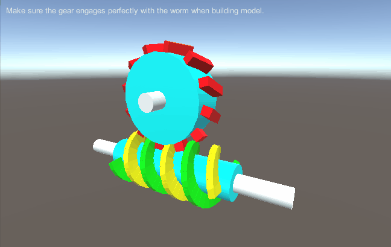
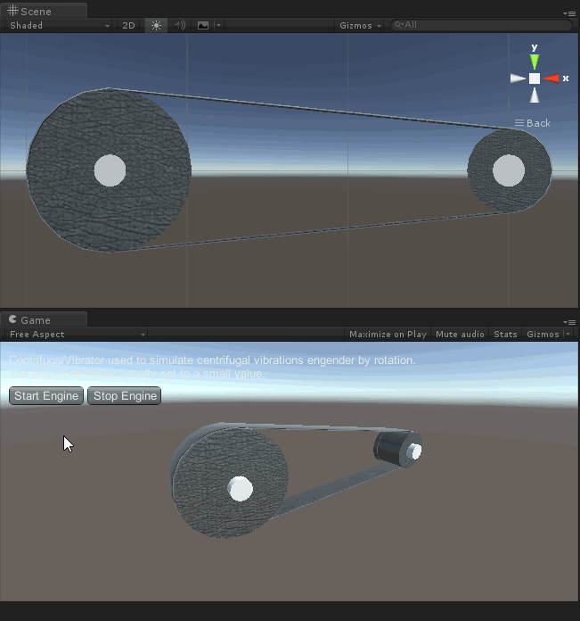
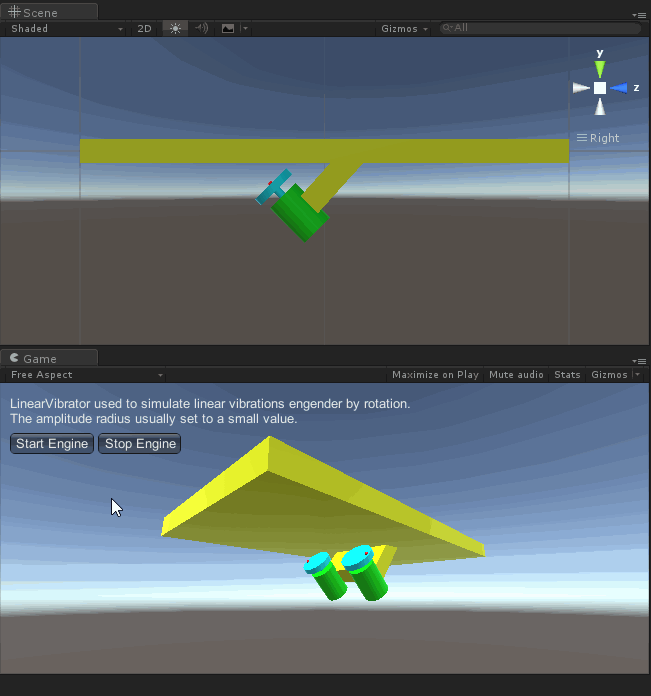
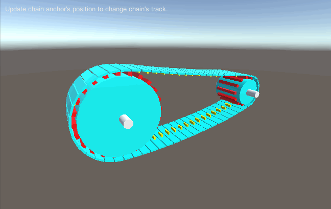
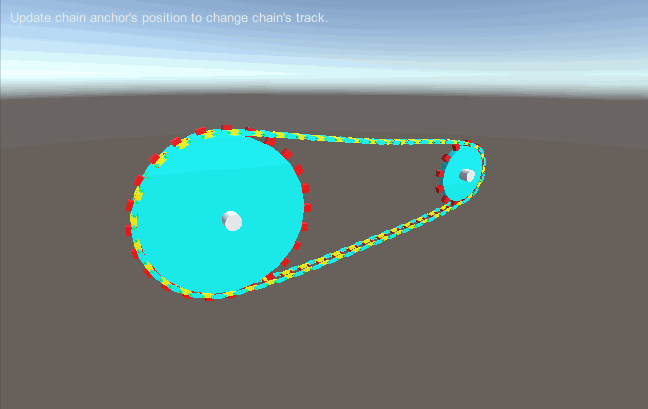
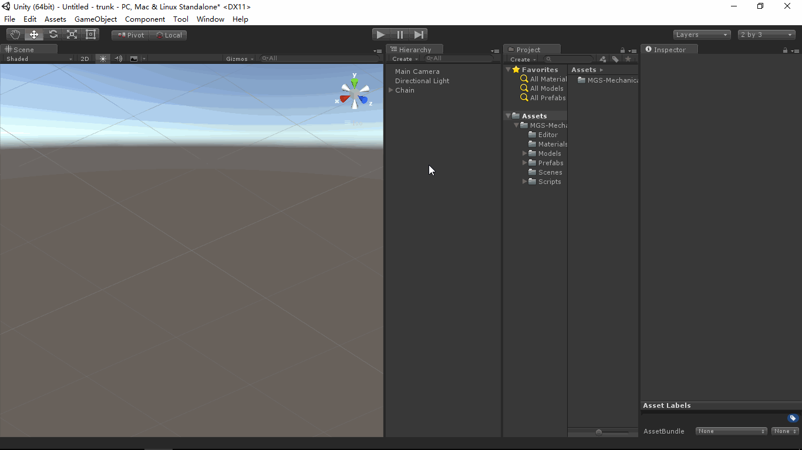

# MGS-MechanicalDrive
- [English Manual](./README.md)

## 概述
- Unity 绑定机械传动插件包。

## 需求
- 绑定啮合齿轮传动机构。
- 绑定按比例速度同步传动机构。
- 绑定蜗轮蜗杆传动机构。
- 绑定皮带飞轮传动机构。
- 绑定链条齿轮传动机构。

## 环境
- Unity 5.0 或更高版本。
- .Net Framework 3.0 或更高版本。

## 方案
- 统一线速度驱动啮合齿轮，齿轮角速度依据齿轮半径计算。
- 统一线速度驱动各个机构单元，单元的线速度依据比例计算。
- 统一线速度驱动蜗轮蜗杆，蜗杆角速度依据蜗杆半径计算；蜗轮角速度依据蜗杆头数（螺旋线条数）和蜗轮齿数计算。
- 统一线速度驱动飞轮，皮带转动速度依据比例计算（保持皮带与飞轮同步）；皮带转动使用UV动画实现。
- 统一线速度驱动齿轮，链条；链条转动轨迹使用动画曲线AnimationCurve实现。

## 实现
- Gear：齿轮，绕Z轴向作圆周运动。
- Belt：传送带，UV沿X方向移动模拟运转。
- Chain：链条，由相同的链节点连接而成，依据锚点路径移动和旋转。
- DynamicChain：动态链条，在Chain的基础上适应路径锚点变化，模拟由于重力，振动等原因导致的链条轨迹变形。
- RollerChain：滚子链，由两个不同的链节点交替连接而成，依据锚点路径移动和旋转。
- DynamicRollerChain：动态滚子链，在RollerChain的基础上适应路径锚点变化，模拟由于重力，振动等原因导致的链条轨迹变形。
- LinearVibrator：线性振动器，沿Z轴向作往复运动。
- CentrifugalVibrator：离心振动器，绕Z轴向作离心运动。
- Synchronizer：同步器，统一线速度驱动同步器的所有机构。
- Transmission：变速器，按指定比例线速度驱动变速器的相应机构，用于协调多个机构的运转。
- WormGear：绑定蜗轮蜗杆。
- Engine：引擎，统一驱动所有机构。
- Damper：阻尼器，模拟引擎启动后加速，停止后减速等效果。

## 案例
- “MGS-MechanicalDrive/Prefabs”目录下存有上述机械传动绑定的预制，供读者参考。
- “MGS-MechanicalDrive/Scenes”目录下存有上述机械传动绑定的演示案例，供读者参考。

## 预览
- MeshGears

- WormGear

- Belt

- Vibrosieve

- DynamicChainSys

- DynamicRollerChainSys

- NodeEditor

## 联系
- 如果你有任何问题或者建议，欢迎通过mogoson@qq.com联系我。